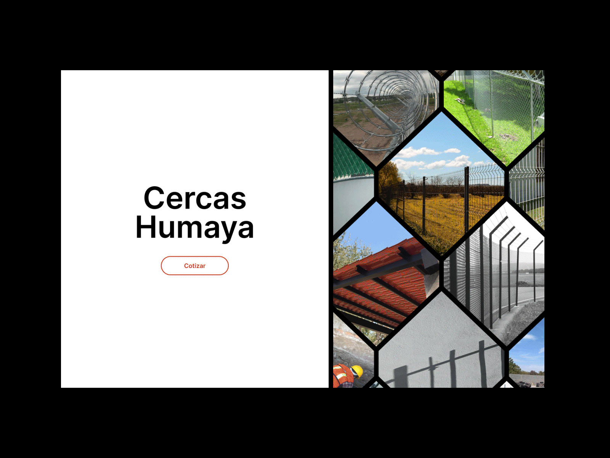

# Cercas Humaya Website

This repo contains the source code for the Cercas Humaya Website, a creative and interactive website I designed and deveoped for Cercas Humaya, a Mexican company focused on the safety of its clients, offering them galvanized cyclonic mesh installation services for their homes, land or any place where it is required. They also provide architectural project services, blacksmithing and home maintenance.

[](https://cercas-humaya.vercel.app/)

## Demo

[See it live on Vercel](https://cercas-humaya.vercel.app/)

## Installation

To run this project locally, follow these steps:

1. Clone the repository: 

```sh
git clone https://github.com/peperini/cercas-humaya.git
```

2. Add your `.env` environment variables file to the project folder

Your .env file should contain:

```sh
PRISMIC_REPOSITORY=
PRISMIC_ACCESS_TOKEN=
```

Ensure these are properly set to connect with Prismic services.

3. Install dependencies:

```sh
npm install
```

4. Start the development server:

```sh
npm start
```

## Technologies Used

- PUG (HTML Template Engine)
- SCSS
- JavaScript
- Express
- Prismic (CMS)
- GSAP
- OGL (WebGL)
- GLSL Shaders
- Webpack
- Node
- Vercel

## Features and Functionality

- Interactive animations
- Responsive design for different screen sizes
- Smooth transitions and scroll effects
- Optimized performance and loading times

## License

[](https://opensource.org/licenses/MIT)

## Contact

If you have any questions or comments regarding this project, feel free to reach out to me:

- Email: josearmando@gothier.co
